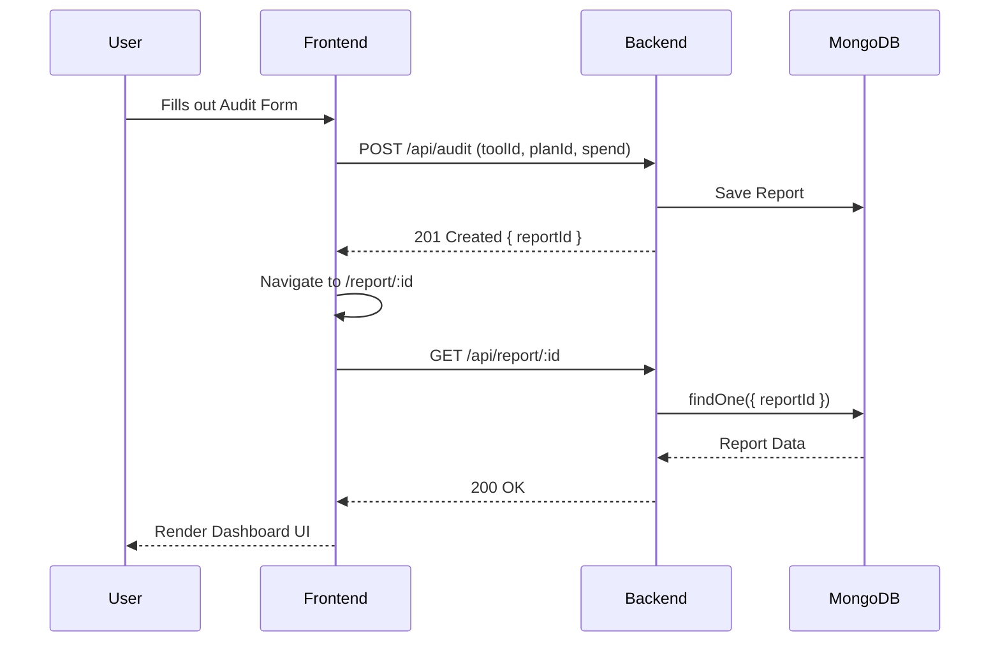

# Frontend Architecture

## React Component Structure
The project uses a modular component structure heavily relying on `shadcn/ui` for consistent design semantics.
- `src/components/audit/`: Audit form and tool selection logic.
- `src/components/results/`: Dashboard rendering, charts, and recommendations.
- `src/components/landing/`: Marketing and hero sections.

## Route Flow
We use `react-router-dom` for client-side routing:
1. `Landing (/)` → Guides user to start audit.
2. `Audit Form (/audit)` → Gathers tool usage.
3. `Dashboard (/results)` → Immediate feedback.
4. `Report (/report/:id)` → Fetched from backend via ID.

## State Management
We use Zustand (`useAuditStore`) to persist the user's audit input locally before they submit the final form.

## Mermaid Diagrams

### Audit Generation Lifecycle

